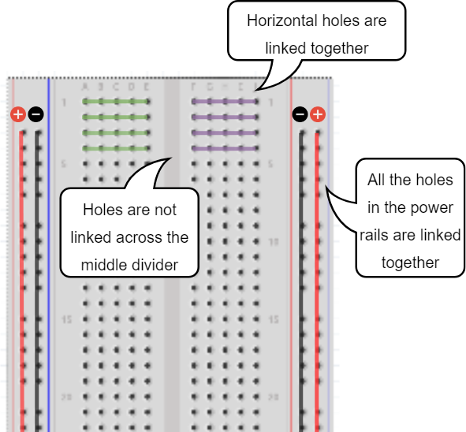

# Arduino Code Club

The purpose of this Code Club exercise to is get kids excited about Coding, Electronics and Technology. The material aims at providing kids with exerices which they can completed in a 4 hour workshop and take away with them working project which they could demonstrate to their family and friends.

This exercise is inspired by [Blink Master](https://www.hackster.io/rmbyers/blink-master-78aa7a) by [Rick Byers](rickb@rbyers.net) 

## Introduction to Arduino
Adruino is a microcontroller. A microcontroller is a small computer but multiple magnitudes less powerful as compared to a typical computer. Arduino excels at performing small tasks using a small amount of power(electricity) very reliably.  

## Basic concepts of Electricity

### Electricity 
Electricity is described as the rate of flow of charge(electrons). It is measured measured using a unit called Ampere (A).

### Resistance
A resistor or resistance, resists the flow of electricity. The larger the value of the resistor, lesser the current flow through the circuit.

### Voltage
Voltage is the difference in the charge between two points in the curcuit.

- Water = Charge (measured in Coulombs)
- Pressure = Voltage (measured in Volts)
- Flow = Current (measured in Amperes, or “Amps” for short)
- Hose Width = Resistance

[Insert diagrams from Sparkfun](https://learn.sparkfun.com/tutorials/voltage-current-resistance-and-ohms-law)

Electricity flows from positive to negative terminal. If there is no or little resistance in the circuit it will cause too much current to flow and curcuit will get destroyed. This is called _short circuit_.

> :warning: __Warning__
> - Make sure you check the curcit carefully before connecting power
> - Always disconnect power before modifying the curcuit.

## Breadboard basics
A breadboard is used to make up temporary circuits for testing or to try out an idea.

- The breadboard consists of a number of holes into which electronic componets could be inserted. 
- The holes are connected to other holes in a definate pattern as shown below and small wires called jumper wires could be inserted into the holes to connect different electronic components together.

> :pencil: Further Reading - https://learn.sparkfun.com/tutorials/how-to-use-a-breadboard