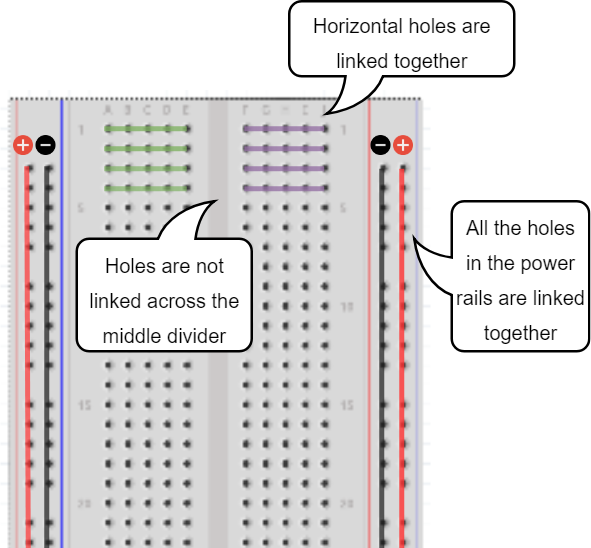
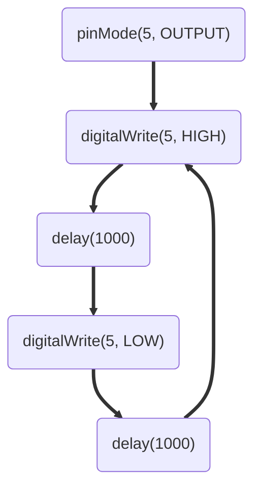

[TOC]

# Arduino Code Club

The purpose of this Code Club exercise to is get kids excited about Coding, Electronics and Technology. The material aims at providing kids with exercises which they can complete in a 4 hour workshop and take away with them working projects which they could demonstrate to their family and friends.

This exercise is inspired by [Blink Master](https://www.hackster.io/rmbyers/blink-master-78aa7a) by [Rick Byers](rickb@rbyers.net)

## Introduction to Arduino
Arduino is a microcontroller. A microcontroller is a small computer but multiple magnitudes less powerful as compared to a typical computer. Arduino excels at performing small tasks using a small amount of power(electricity) very reliably.  

## Basic concepts of Electricity

### Electricity

Electricity is described as the rate of flow of charge(electrons). It is measured measured using a unit called Ampere (A).

### Resistance

A resistor or resistance, resists the flow of electricity. The larger the value of the resistor, lesser the current flow through the circuit.

Resistance is measured in Ohms (&#937;)

### Voltage

Voltage is the difference in the charge between two points in the circuit.

- Water = Charge (measured in Coulombs)
- Pressure = Voltage (measured in Volts)
- Flow = Current (measured in Amperes, or “Amps” for short)
- Hose Width = Resistance

[Insert diagrams from Sparkfun](https://learn.sparkfun.com/tutorials/voltage-current-resistance-and-ohms-law)

Electricity flows from positive to negative terminal. If there is no or little resistance in the circuit it will cause too much current to flow and circuit will get destroyed. This is called _short circuit_.

> :warning: __Warning__
> - Make sure you check the circuit carefully before connecting power
> - Always disconnect power before modifying the circuit.

## Breadboard basics

A breadboard is used to make up temporary circuits for testing or to try out an idea.


- The breadboard consists of a number of holes into which electronic components could be inserted.
- The holes are connected to other holes in a definite pattern as shown below and small wires called jumper wires could be inserted into the holes to connect different electronic components together.



> :pencil: Further Reading - https://learn.sparkfun.com/tutorials/how-to-use-a-breadboard

## Exercise 1 : Blink an LED

### Components Needed:

- Arduino
- 1 LED
- 1 Resistor (220 &#937;)
- USB Cable
- Computer with Arduino IDE installed

### Step 1: Assemble to circuit

Assemble the circuit as shown in the below picture.


- Connect the positive (longer) leg of the LED to `pin 5` of Arduino
- Connect the 220&#937; resistor to the negative(shorter) leg of the LED
- Connect the other leg of the resistor to the `GND` pin of Arduino

> :pencil: The resistor is needed to protect the LED. Resistor will limit the amount of current that can pass through the LED.

#### Programing Concepts

- A program is a bunch of instructions which tell Arduino what actions to take.
- Arduino programs are written using C language and we called `sketches`.
- `//` indicates the start of a comment. Arduino ignores all the text in a line of code, which follow this symbol.
- We can have comments which span multiple lines. They are marked by /* */. Any text between these two symbols is ignored.
- Lines of code in C language usually end with a semi-colan `;`
- We can name a block of code in C language so that block of code could be used multiple times without causing duplication. Such named block is called a `function` and looks like below
    ```C 
    void int function add() {
        /* code to be
           reused
        */
    }
    ```
    Here we have declared a function called `add`.
- An Arduino function must have function called `setup` and `loop`.
  - `setup` function gets run automatically when the programs runs.
  - `loop` function keeps running repeatedly over and over again.
- We can tell Arduino if we want to use a pin for input or output by using an already available function called `pinMode()` 
- `digitalWrite()` is an built-in function using which we can set the pin `high` or `low`. 
    > High means that the pin as a voltage of 5V and low means that the voltage at the pin is zero volts (GND).
- The built-in function `delay()` causes Arduino to wait for the desired amount of time before the next line of code is executed.


### Step 2: Program arduino
Copy and past the below code to your Arduino IDE and upload it.

```C{.line-numbers}
void setup()
{
    pinMode(5, OUTPUT);
}

void loop()
{
    digitalWrite(5, HIGH);
    delay(1000); // Wait for 1000 millisecond(s)
    digitalWrite(5, LOW);
    delay(1000); // Wait for 1000 millisecond(s)
}
```

If the connections to the Arduino have been made correctly and the sketch is uploaded successfully, the LED should start blinking such that it's "on" for 1 second and "off" for 1 second in a loop.

#### Program breakdown

- Code from line 1 to 4 is the mandatory `setup()` function. 
- Inside the `setup()` function we call the `pinMode()` method, which takes two values(arguments). First argument is the pin number(in our case 5) and second is either `INPUT` or `OUTPUT` which tells Arduino if we want to use the pin for input(e.g. reading sensor value) or output(e.g. setting the pin high or low)
- Lines 6-12 is the mandatory `loop` function. This makes the code on lines 8-11 run repeatedly. 
- On line 8 we set the pin 5 to a value of "HIGH" i.e. provide 5v power to the pin which turns the LED "On"
- On line 9 we wait for 1000 milliseconds i.e. 1 second
- We then turn the LED off by setting the pin 5 to a value `LOW` which sets the power to the pin to zero volts or GND.

So the flow of the program is something like below



#### Challenge : Change On/Off time

Problem: Presently the LED stays "on" and "off" for a second each. Change the program so that the LED stays on for 2 second and off for 500 milliseconds.

### Refactor program

**Concept:**

- A variable in C language is like a box in which we can store different type of information e.g. a integer or string values etc.
- Variables need to be declared before they could be used in the program.
- Variables can be declared and assigned a value like so `int pin = 5;`. Here we have declared a variable called `pin` and stored and integer value value 5 in it. The `int` before "pin" tells the Arduino that the variable can only store values that are of type "integer".
- From hereon, we can use the variable `pin` in place of 5 in the program.
- Like a box we can replace the item(in this case value) stored in the variable. e.g. `pin =6;`. This causes the previous value 5 to be replaced by 6.
- `const` keyword if specified before the variable name means that the variable's value cannot change. e.g. `const int pin = 5`. Trying to assign a different value to `pin` variable will result in an error.

**Problem Statement:** 
If we change the wiring of our circuit and connect the LED to say pin 6, we need to modify the program and change the pin number throughout the program. 

**Solution**
Store the LED pin into a variable like below.

```C{.line-numbers}
cont int LED = 5; //LED is connected to pin 5 of Arduino

void setup()
{
    pinMode(LED, OUTPUT);
}

void loop()
{
    digitalWrite(LED, HIGH);
    delay(1000); // Wait for 1000 millisecond(s)
    digitalWrite(LED, LOW);
    delay(1000); // Wait for 1000 millisecond(s)
}
```
Now if the circuit changes and the LED is connected to pin 6 instead of pin 5, we need to update the code only in line number 1.
