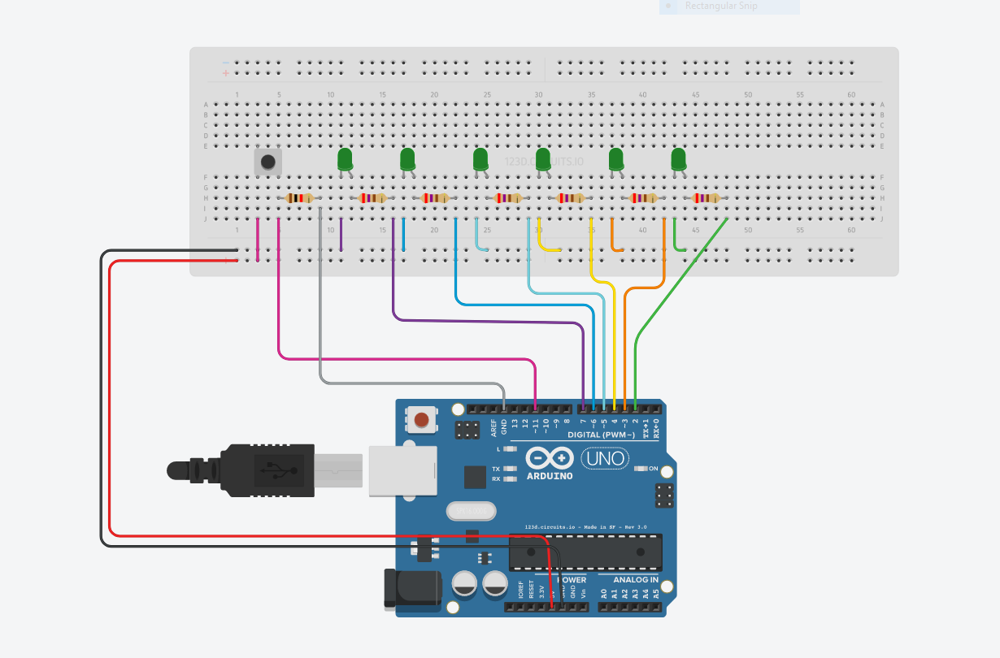
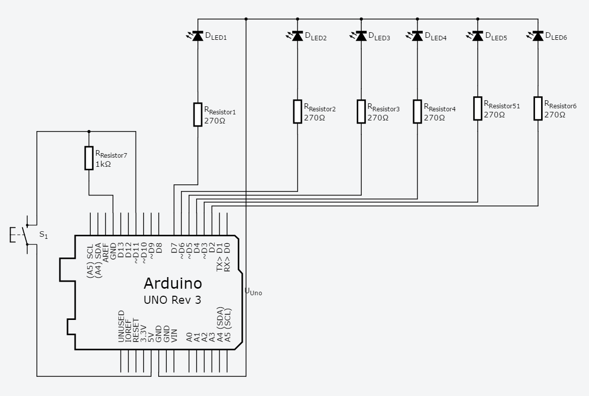

# Dice Game

This sketch is to simulate a Dice throw.

There are 6 LEDs which are connected to digital `pins 2-7`. See
the lab view or the schematic below.
> Do not connect the LEDs to digital pin 0 & 1. These pins double up for serial communication and the state of these pins will become unpredictable if you write Serial.begin() in your code.

There is a Pushbutton connected to digital `pin 11`

Pressing the pushbutton is analogous to throwing the dice.

Anticipation is build by flashing all the 6 LEDs in a sequential pattern and then result of the throw is revealed by lighting up LEDs ,in sequence, equal to the generated random number.

## Try it
Click on the link below to see the sketch in action through AutoDesk Circuits simulation.

[Play the game](https://circuits.io/circuits/5296490-dice-game/embed#breadboard)

Hit "Start Simulation" button and then click on the PushButton to throw the dice.

## Lab view

## Schematics

