# Weather Station

## Temperatue and  Humidity display using DHT11 and 7 segment display

DHT11 is a temperatue and humidity sensor. We are going to display the temperatue and humidity data onto a 4 digit 7 segment display.

## Parts needed
1. Arduino Uno/Nano
1. DHT11 sensor
1. 4 digit 7 segment display (common annode)
1. SN74HC595 shift register (SIPO)
1. 4 * 1k ohm resitors
1. 1 10k ohms resitor
1. 8 220 ohm resitors

## Schematic
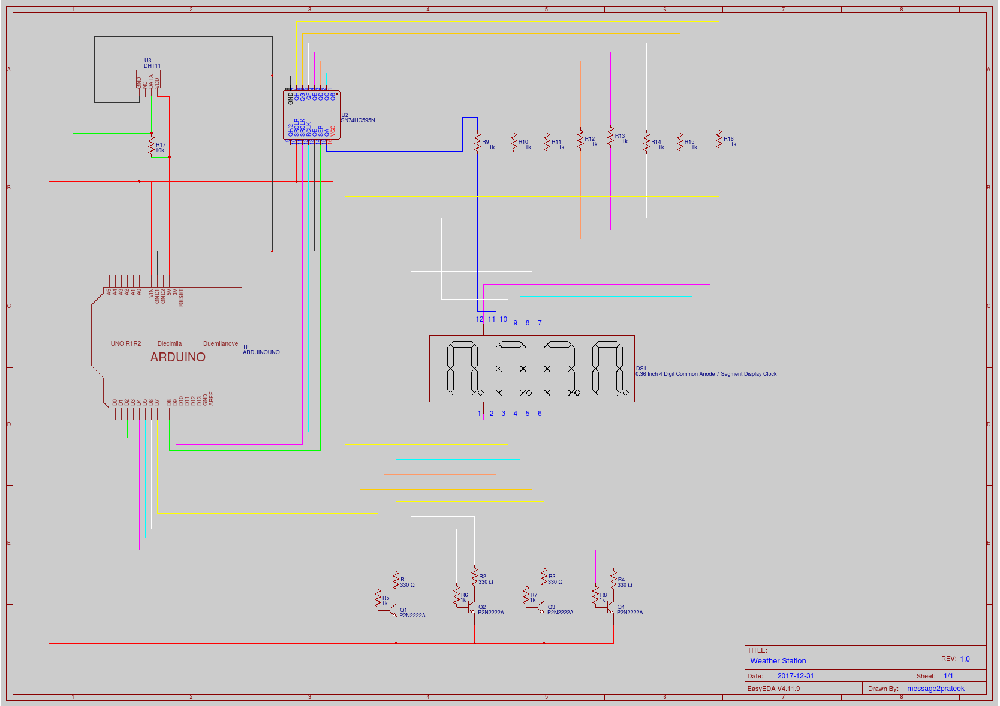

## Parts Resources

### DHT11
DHT11 sensor is breadboard friendly and is smiple to use. Only 3 of it's 4 pins are used.
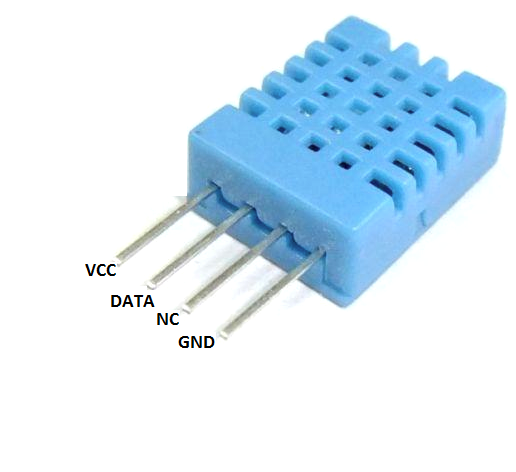

:pencil: DHT11 requies a 10k ohm pull-up resistor on the data pin.

:exclamation: The sensor can take a reading only every 2 seconds

[More details from Adafruit's learning site](https://cdn-learn.adafruit.com/downloads/pdf/dht.pdf)

### 4 Digit 7 segment display
For this project I am using a 4 Digit 7 Segment display of type __*common annode*__.

These dipslays are simple devices where each digit is made up of 7 LEDs put together, named A-G as in the image below. There is also a 8th circular LED present for each digit for displaying decimal point and is called *DP*.
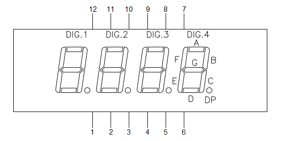

The LEDs of the display are called a "Segment" because each LED represents a segment of the number we want to display. By controlling which of the 7 LEDs are swtiched ON at a time, we are able to display numbers and certain characters e.g. in order to display number 0 we are going to light up all the LEDs of a digit expect LED "G".

Below image shows LEDs combination to be swtiched ON to display numbers 0-9.

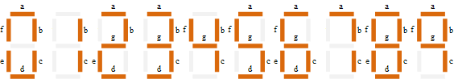
 

#### Common annode vs Common cathode displays
What makes these displays a little tricky to use is how the LEDs are connected together within each digit(of the display) and also across to other digits.

Based on how the LEDs are connected, these display come in two variety -
1. common annode (if annodes of each LED within a digit are connected together)
1. common cathode (if cathodes of each LED within a digit are connected together)

The image below shows how LEDs of a common annode display are connected and the pin numbers which expose them.
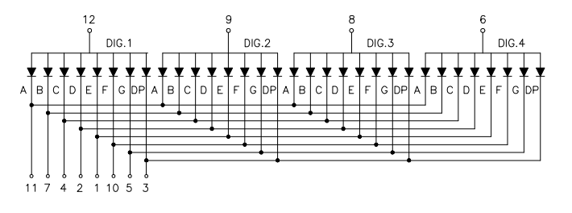

Here we can see that for each individual digit, annodes of all the 8 LEDs (A~G + DP) are connected together. Annodes of DIG. 1 are connected together and exposed as pin 12 of the display, annodes of DIG.2 are connected together and exposed as pin 11 and so on...

Another interesting observation is that each named LED of each digit is connceted to corresponding named LEDs of other digits of the display i.e. all the LEDs named "A" of each digit are connected together, all the "B" LEDs are connected together and so on.

If we provide power such as we connect positive terminal to pin 12 and the negative terminal to pin 11, current will flow thought pin 12 to LED "A" and out of pin 11. This means LED segment called "A" on Digit 1 will light up.

Now to the above configuration if we connect the pin 9 to the positve terminal as well, now the current will enter throught both pin 12 and 9 and pass through both LED A on DIG. 1 and LED A on DIG. 2 thus lighting LED "A" on both 1st and 2nd digits.

[Refer Datasheet](http://docs-europe.electrocomponents.com/webdocs/12fb/0900766b812fb993.pdf)

#### Displaying Data
##### Displaying number 1
Armed with the information so far, suppose we want to display number 1. For displaying number 1 we need to light up LEDs B and C on DIG. 4. As per the image above DIG 4. is connected to pin 6 of the display, so we need to connect ping 6 to the positive terminal. Also, LED B and C are exposed through pins 7 and 4, so we need to connected both pins 7 and 4 to the negative terminal. Now we should see "1" displayed.

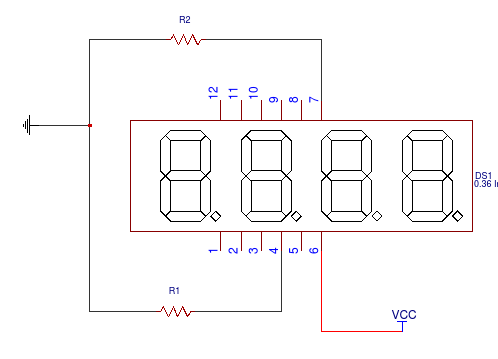

##### Displaying number 11
To display number 11 we need light up LEDs B and C on both DIG. 1 and DIG. 2. We can acheive this by connecting pin 8 to the positve terminal as well in the schematic we used for displaying number 1.
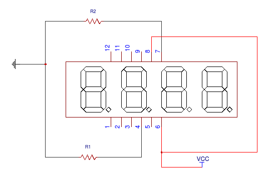

##### Displaying different numbers on different digits
Suppose we need to display number 17. :warning: Now we have a problem.

Due to how the LEDs in the display are connected, we are able to only display the same number at the same time on more than 1 digits. We need a mechanism to be able to control digits in isolation.

###### Enter Multiplexing
Multiplexing for 7 segments display means that instead of trying to display all the 4 digits together, we display only 1 digit at a time, swtiching from one digit to another so quickly that the human eye perceives that all the 4 digits are ON at the same time.

Consider the below schematic. Here we have introduced switches to the connections for DIG3(pin 8), DIG4(pin 6) as well as ping for LED segments A(pin 11), B(pin7), C(pin4). I have named the switches appropriately to identify what they are switching.

We will be Multiplexing DIG3 and DIG4 for simplisity sake.

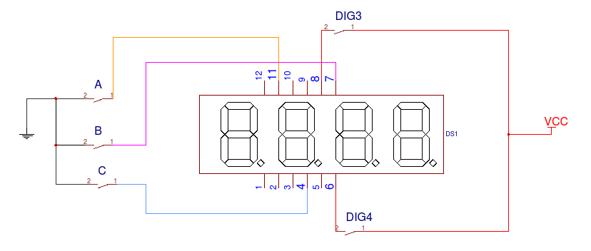

We'll start with all the switches in the OFF position.

 _Step 1_
For displaying number 7 on the unit digit. We'll flip to swtich called DIG4 to the ON position. Along with that we'll flip the switches called A, B, C ON as well.

 _Step 2_
For displaing number 1 on the tens digit, we flip DIG4 OFF(switching DIG4 off) and then swithing on DIG3. We'll also keep LED B and C ON, but switch LED A OFF

If we now repeat step 1 and step 2 very qucikly our eyes will perceive both DIG3 and DIG4 to be ON at the same time and number 17 to be displayed.

Summary of the steps

|Iteration | DIG3 | DIG4| A| B| C|
|:--------:|:----:|:---:|:--:|:--:|:--:|
|0|OFF|OFF|OFF|OFF|OFF|
|1|OFF|ON|ON|ON|ON|
|2|ON|OFF|OFF|ON|ON|
|3|same as iteration 1|
|4| same as iteration 2|
|...|

> :pencil: We will be using Arduino to perform the switching for us.

> Multiplexing is a technique of combining more than one input signals into a more complex signal and then deliver each signal in isolation.
[Read more on Multiplexing](https://en.wikipedia.org/wiki/Multiplexer)

### Shift Register

Problem
  : In order to switch and control our display with Arduino alone we need 12 GPIO pins, where each GPIO pin switches one pin on the display. If we now want to connect other sensors etc to Arduino, we might not have enough GPIO left on an UNO or NANO.

Solution
  : Shift registers

SN74HC595, used in this example is a Serial-In Parallel-Out(SIPO) shift register. This means it accepts data in a serial format(1 Bit at a time) and outputs a Byte(8 bits) of data simultaniously onto it's output pins, which can be pictured as a parallel output.

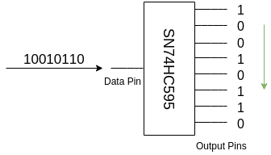
In the diagram above we can see the a serial binary data i.e. "10010110" is being fed to the data pin of the Shift Register and it outputs each bit of the binary number on it's output pins simultaniously.

SN74HC595 is generally used as output expander for Arduino since the chip produces output on 8 pins by accepting input throught 1 data pin. This means that instead of using 8 GPIO pins on an Arduino we only need to use 1 GPIO pin, which provides input data to the shift register.

#### How Shift Regiters work
##### PinOut
SN74HC595 Shift Register IC contains 16 pins as below
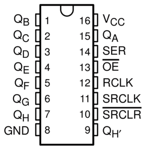
Vcc
 : Input voltage

Q~a~ - Q~h~
 : Output pins

SER
 : Data pin.

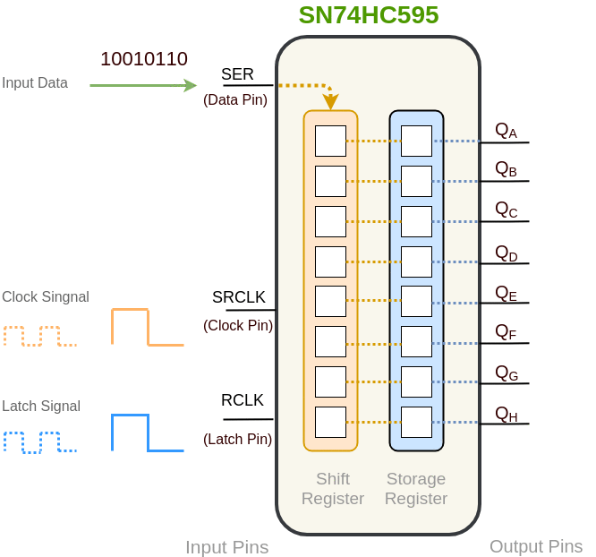

> :bulb: This is over simplified explanation for simplisity sake.

Internally shift registers comprise of
