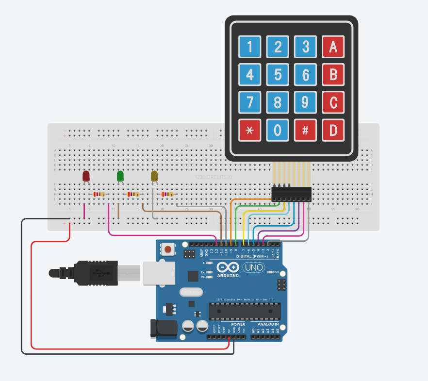
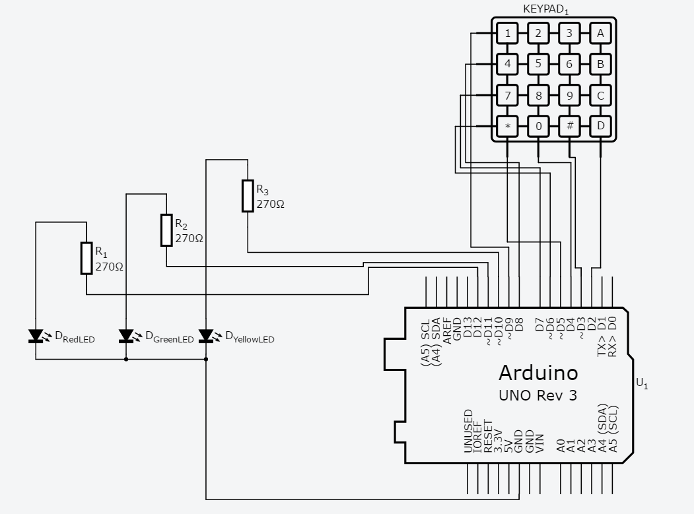

# Security Lock

## Description
This project mimics a security lock with a numbered keypad. The status of the lock is indicated by different LEDs.

This sketch uses this Keypad library http://playground.arduino.cc/Code/Keypad

## Gameplay
User is required to enter key combination to open a fictitious lock. The status of lock is indicated by different color LEDs as below.

| LED Color 	| Feedback                                                      	|
|-----------	|---------------------------------------------------------------	|
| Red       	| When switched ON, indicates that the lock is closed.          	|  
| Green     	| When switched ON, means the lock is open.                     	|
| Yellow    	| Provides feedback to user's key press by momentarily flashing 	|

User can press keys 1-9 and A-D to provide a key combination. Key combination is submitted for verification against a pre-configured password by hitting the `#` key.

User can also hit `*` key to start again in case a wrong key in pressed.
> With this option user will have to provide the whole key combination again and not just the last key.

## Material required
- One 4X4 or 3X4 keypad
- 3 LEDs (Red, Green, Yellow)
- 3 270 Ohm resistor or of higher value
- Arduino UNO or similar.

## Try it
Click on the link below to see the sketch in action through AutoDesk Circuits simulation.

[Click Me](https://circuits.io/circuits/5297389-security-lock/embed#breadboard)

## Lab view

## Schematics view

